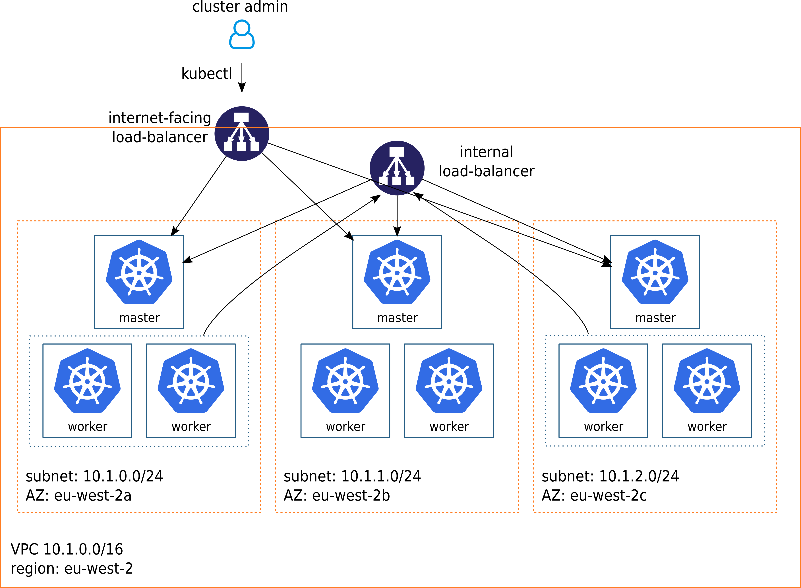

# AWS EC2 infrastructure provider

This infrastructure provider uses [Terraform](https://www.terraform.io) to
create the AWS infrastructure needed to host a Kubernetes cluster.

The provisioned infrastructure typically looks something like

This infrastructure is created in a given AWS region (such as `eu-west-2`) and
VPC. One can either specify an existing VPC (via `${vpc_id}`) or leave it
unspecified to have Terraform create a new VPC (with a given IP address range,
as specified by `${vpc_address_rance}`.

Some notable details on the spawned infrastructure:

- It makes use of several availability zones, and spreads masters and worker
  nodes over the AZs in a round-robin manner to promote fault-tolerance. The
  setup illustrated in the image can withstand the loss of an entire AZ
  while still being operational.

- A VPC-internal load-balancer is used to connect workers with the masters. This
  allows the cluster communication to remain within the cluster. The
  load-balancer uses health-checks to only forward traffic to working master
  nodes.

- A separate internet-facing (public) load-balancer is set up to allow a cluster
  administrator to access the apiserver (via `kubectl`).

## Configure
The Terraform script ([main.tf](main.tf)) requires some input in order to
provision servers. The set of parameters is quite large but most of the
parameters are optional and can safely be left out.

Terraform will prompt for (missing) mandatory variables. This can be a bit
tedious, and one can therefore place variables in one or more
[variable files](https://www.terraform.io/intro/getting-started/variables.html)
which are passed with `--var-file` flags.

The mandatory parameters are:

- `aws_access_key`: AWS Access Key ID of IAM user that will be used to run
  Terraform.

- `aws_secret_key`: AWS Secret Access Key of IAM user that will be used to run
  Terraform.

- `region`: The AWS region where the infrastructure is to be created. For
  example, `eu-west-2`.

- `cluster_name`: A name that should describe the purpose of the cluster (for
  example, `customer-x`). Although not strictly necessary, make sure that you
  use a unique name for each cluster, since the cluster name will be used to tag
  created resources (and will help you distinguish resources belonging to
  different clusters).

- `vpc_id`: can either be set to the ID of an existing VPC (e.g.,
  `vpc-9b716af2`) or left unspecified to have Terraform create a new VPC. If a
  new VPC is to be created, `${vpc_address_range}`, the VPC CIDR block  should
  be specified (for instance, `10.0.0.0/16`).

- `availability_zones`: Describes how to set up cluster subnets across
  availability zones. The master and worker nodes will be assigned to AZs in a
  round-robin manner. Three AZs are desirable to promote a fault-tolerant setup
  that can withstand the loss of one availability zone.

    It could look something like (note that the AZs must be within the specified
    `${region}` and the subnet cidr blocks must be proper subsets of the VPC's
    CIDR block):

        availability_zones = {
           "us-east-2a" = {
             "subnet_cidr_block" = "10.0.0.0/24"
           }

           "us-east-2b" = {
             "subnet_cidr_block" = "10.0.1.0/24"
           }

           "us-east-2c" = {
             "subnet_cidr_block" = "10.0.2.0/24"
           }
         }

- `num_masters`: The number of master nodes to create. Needs to be at least
  three for high-availability.

- `num_workers`: The number of worker nodes to create.

There are a bunch of optional arguments, most of which can safely be
ignored. Notably, one can set the SSH login key to use for created VMs via
`ssh_private_key_path` and `ssh_public_key_path`.

An example configuration is shown in
[examples/config.tfvars](examples/config.tfvars).

To view all available configuration options see [main.tf](./main.tf).

## Run

    # initialize the working directory
    terraform init infra-providers/aws

    # plan the provsioning (this is a dry-run that won't execute anything)
    terraform plan -var-file config.tfvars infra-providers/aws

    # execute the provisioning plan
    terraform apply -var-file config.tfvars infra-providers/aws

### Output
When `terraform apply` finishes, it outputs information about the infrastructure
it produced. Some of these output items need to be passed to the installer.
These include:

  - `master_public_ips`: needs to be set in the `publicIP` field for each master
    in the cluster definition.
  - `master_private_ips`: needs to be set in the `privateIP` field for each
    master in the cluster definition.
  - `worker_public_ips`: needs to be set in the `publicIP` field for each worker
    in the cluster definition.
  - `worker_private_ips`: needs to be set in the `privateIP` field for each
    worker in the cluster definition.
  - `master_internal_loadbalancer_fqdn`: needs to be set in the
    `masterLoadBalancerAddress` field in the cluster definition.
  - `master_public_loadbalancer_fqdn`: needs to be added to the list of master
     FQDNs in `masterFQDNs`.

### Install Kubernetes
Once all VMs have booted, it is time to run the installer (refer to
the [README.md](../../README.md)).
